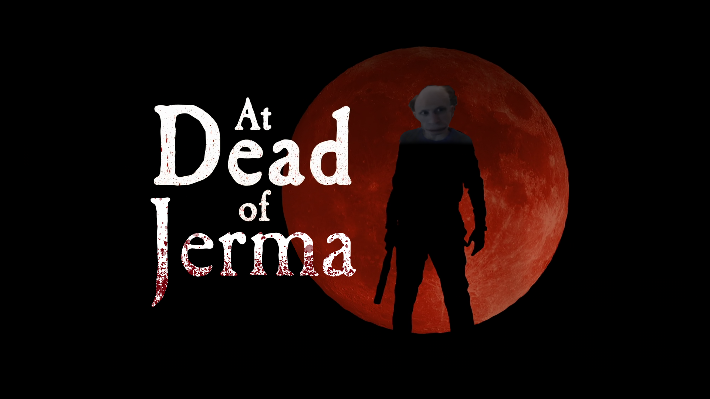

# At Dead of Jerma

Unofficial mod for At Dead of Night that replaces Jimmy with Jerma985.

[Watch it on YouTube](https://www.youtube.com/watch?v=bBgYWs2MOC8)

## Installation

1. Download the latest release from the [Releases](https://github.com/AtDeadOfNight/at-dead-of-jerma-mod/Releases)
2. Replace package.nw files in the game's file with the ones in the release
3. Make sure to backup the original files in case you want to revert the mod and also make sure you're not replacing whole package.nw directory, just the conflicting files